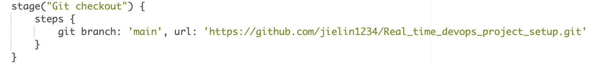
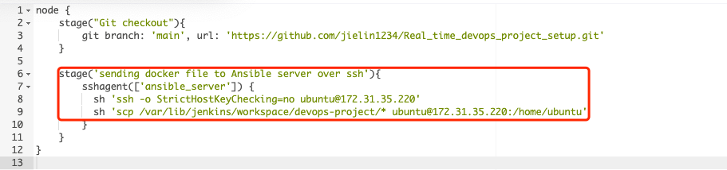
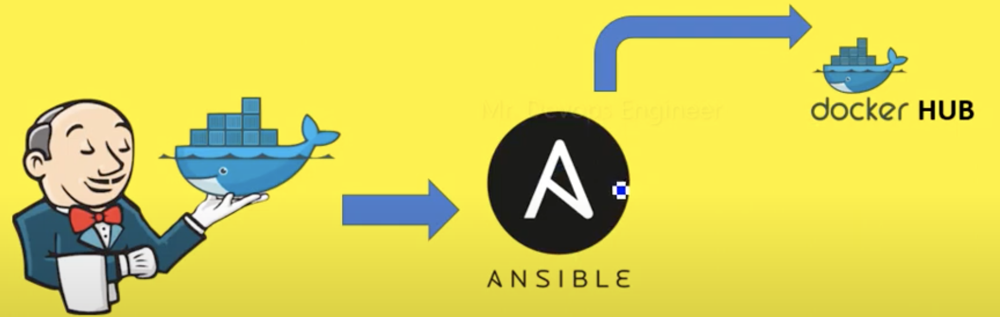
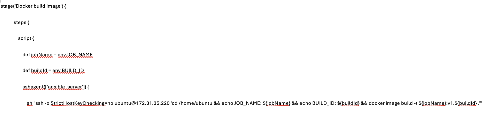
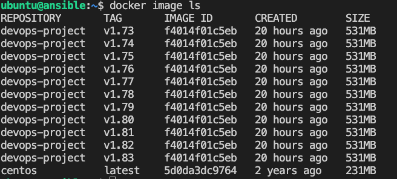

**A real time deployment on K8S cluster using Jenkins CI/CD Project

What to achieve ?
We will have a deployment over a K8S cluster using jenkins CI/CD pipeline with various tools.

Devops tools:
- github (jielin1234/Real_time_devops_project_setup)
- jenkins (devops-project)
- ansible
- k8s cluster
- docker

Pre-requisites: 
Git, Linux, Jenkins, Docker, Dockerhub account, Ansible, K8S.
3 EC2 instances:
Jenkins, Ansible, Webapp (K8s cluster)
[[Account details]]

Scenario:
Developer write a docker file, push it to a github repository. The github will then notify the jenkins whenever there is a commit through webhook. Once jenkins start building, it will pull out all the code from github repo, then ssh into the ansible server and it will start executing/building the image based on the docker file. It will also tag it and push to the docker hub.

2nd task of ansible server is to ssh to the k8s cluster server and ansible will run a playbook so that it will run the kubectl command on the webapp(which is our k8s cluster) and will try to fetch the latest image that it has just build and pushed. Same thing, it will pull from the docker hub and start building a container from the image and the container should be accessible to end user.

Process:
1.[[Installation of the tools]]

2.Write Docker file, Git commit and trigger jenkins job using webhook
![[Pasted image 20240531121311.png]]
2.1.Download https://www.free-css.com/assets/files/free-css-templates/download/page254/photogenic.zip to local computer

- Write the [[Docker file]] and commit to Github
- Jenkins to pick up the code and start building it
	
- Configure [[webhook]] so that it will auto build the pipeline when there is git commit 
- All the files in local will be auto send to Jenkins server once [[webhook]] is configured
	- Stored in Jenkins server /var/lib/jenkins/workspace/(pipeline name)

3.Sending the Docker file from Jenkins server to Ansible (using ssh agent) 

- [[set up ssh connection]] between the jenkins and ansible server.
- Configure the jenkins pipeline to ssh 

4.Build & tagging docker images

All the files will then be copied to Ansible server and Ansible will build the image based on the docker file and also tag the images along for version maintaining.

*Buildid = jenkins build number, jobname = jenkins pipeline name

Every build triggered will create a docker image 

